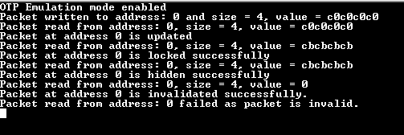

# OTPC read write (emulation)

This example application shows how to use the OTPC Peripheral library to perform OTP operations.

## Description

This example shows how to write, read, update, lock, invalidate and hide OTP packets. All testing is done in emulation mode.

## Downloading and building the application

To clone or download this application from Github, go to the [main page of this repository](https://github.com/Microchip-MPLAB-Harmony/csp_apps_sam_9x7) and then click Clone button to clone this repository or download as zip file.
This content can also be downloaded using content manager by following these [instructions](https://github.com/Microchip-MPLAB-Harmony/contentmanager/wiki).

Path of the application within the repository is **apps/otpc/otpc_read_write_emulation/firmware** .

To build the application, refer to the following table and open the project using its IDE.

| Project Name      | Description                                    |
| ----------------- | ---------------------------------------------- |
| sam_9x75_eb.X | MPLABX project for [SAM9X75-EB Evaluation Board]() |
|||

## Setting up AT91Bootstrap loader

To load the application binary onto the target device, we need to use at91bootstrap loader. Refer to the [at91bootstrap loader documentation](../../docs/readme_bootstrap.md) for details on how to configure, build and run bootstrap loader project and use it to bootstrap the application binaries.

## Setting up the hardware

The following table shows the target hardware for the application projects.

| Project Name| Board|
|:---------|:---------:|
| sam_9x75_eb.X | [SAM9X75-EB Evaluation Board]() |
|||

### Setting up [SAM9X75-EB Evaluation Board]()

#### Setting up the board

- Connect the DBGU0 J34 on board to the computer using a UART-FTDI cable (to enable debug com port)
- Connect the USB port J28 on board to the computer using a micro USB cable (to power the board)

## Running the Application

1. Build the application using its IDE
2. Open the Terminal application (Ex.:Tera term) on the computer.
3. Connect to the (USB to Serial) COM port and configure the serial settings as follows:
    - Baud : 115200
    - Data : 8 Bits
    - Parity : None
    - Stop : 1 Bit
    - Flow Control : None
4. Console displays following message:

    
