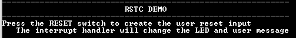

# RSTC interrupt

This example application shows how to use the RSTC peripheral to generate an interrupt instead of generating a reset, when the Reset switch is pressed on board.

## Description

The RSTC peripheral samples the Reset input (NRST pin) at slow clock speed. When the line is detected low, it resets the processor and the peripherals. However, the RSTC peripheral can be programmed to not trigger a reset when an assertion of NRST occurs. The Reset pin state can be read at any time in software or it can also be programmed to generate an interrupt
instead of generating a reset.

## Downloading and building the application

To clone or download this application from Github, go to the [main page of this repository](https://github.com/Microchip-MPLAB-Harmony/csp_apps_sam_9x7) and then click Clone button to clone this repository or download as zip file.
This content can also be downloaded using content manager by following these [instructions](https://github.com/Microchip-MPLAB-Harmony/contentmanager/wiki).

Path of the application within the repository is **apps/rstc/led_switcher/firmware** .

To build the application, refer to the following table and open the project using its IDE.

| Project Name      | Description                                    |
| ----------------- | ---------------------------------------------- |
| sam_9x75_curiosity.X | MPLABX project for [SAM9X75 CURIOSITY Board]() |
|||

## Setting up AT91Bootstrap loader

To load the application binary onto the target device, we need to use at91bootstrap loader. Refer to the [at91bootstrap loader documentation](../../docs/readme_bootstrap.md) for details on how to configure, build and run bootstrap loader project and use it to bootstrap the application binaries.

## Setting up the hardware

The following table shows the target hardware for the application projects.

| Project Name| Board|
|:---------|:---------:|
| sam_9x75_curiosity.X | [SAM9X75 CURIOSITY Board]() |
|||

### Setting up [SAM9X75 CURIOSITY Board]()

#### Addtional hardware required

- SD Card with FAT32 file system

#### Setting up the SD Card

- Download harmony MPU bootstrap loader from this [location](firmware/at91bootstrap_sam_9x75_curiosity.X/build/binaries/boot.bin)
- Copy the downloaded boot loader binary( boot.bin) onto the SD card

#### Setting up the board

- SDMMC slot used for bootloading the application is SDMMC0 (J8)
- Connect the DBGU0 J32 on board to the computer using a UART-FTDI cable (to enable debug com port)
- Connect the USB port J2 on board to the computer using a micro USB cable (to power the board)

## Running the Application

1. Build the application using its IDE
2. Copy the output binary (named 'harmony.bin') onto the SD Card (Refer to the 'Setting up hardware' section above for setting up the SD card)
3. Insert the SD card into SDMMC slot on the board (Refer to the 'Setting up hardware' section for the correct SDMMC slot)
4. Open the Terminal application (Ex.:Tera term) on the computer.
5. Connect to the (USB to Serial) COM port and configure the serial settings as follows:
    - Baud : 115200
    - Data : 8 Bits
    - Parity : None
    - Stop : 1 Bit
    - Flow Control : None
6. Disconnect and reconnect the USB port (J2) to power cycle the board
7. Console displays following message:

    

8. Press the "RESET" switch and observe the LED toggling, and console displays following message:

    

    - *NOTE: push and release RESET switch very quickly so as to not end up cutting power to the PMIC triggering a power on reset (instead of just toggling of the reset pin)*

Refer to the following table for LED name:

| Board      | LED Name                                    |
| ----------------- | ---------------------------------------------- |
| [SAM9X75 CURIOSITY Board]() | RGB_LED toggles between green and blue color for every switch press  |
|||

